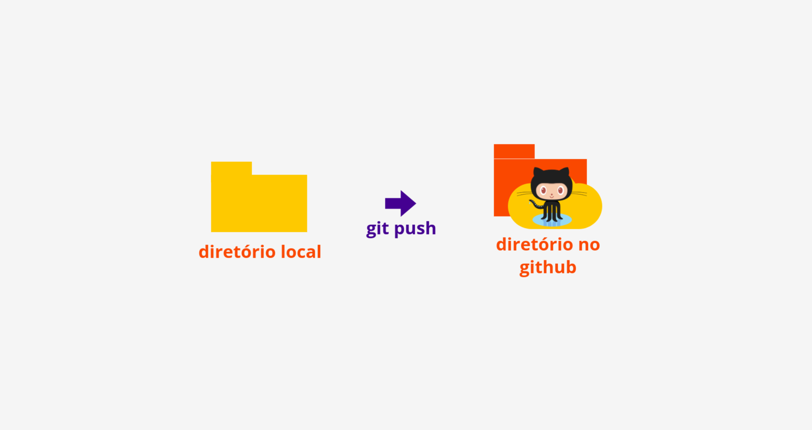

# Trabalhando com repositórios remotos

### Introdução

O GitHub é uma rede social através da qual milhares de pessoas constroem códigos, e podem compartilhar conhecimento, de forma colaborativa, aberta e gratuita.

> "O Github, é na verdade uma rede social ou uma fábrica social de software, que desenvolve e promove milhares de códigos fontes pré armazenados, para as mais diversas finalidades." Wikipedia

Queremos que nossos arquivos sejam armazenados não somente em nosso computador, mas também no Github. Vamos usar alguns comandos do Git para nos ajudar nessa missão.

### Subindo um repositório para o Github



Nossa pasta já existe no computador, mas dentro do Github ainda não, certo? Então, vamos abrir o site do github, criar uma conta, e lá criar um repositório vazio para nosso projeto.

O projeto da sua máquina precisa conversar com o projeto que está lá no Github, para isso, um precisa saber quem é o outro. Vamos voltar ao terminal e dentro da nossa pasta usar um comando que diz o endereço para onde ela deve ir. Lembre de copiar esse endereço lá no Github. Exemplo:

```text
git remote add origin https://github.com/seunome/suapasta.git
```

Agora que a nossa pasta já sabe para onde ela deve ir, vamos pedir que ela vá! Vamos subir os nossos commits que estão em nossa pasta para a pasta que criamos no Github usando o comando push:

```text
git push origin master
```

No primeiro push precisamos especificar o apelido do remote, e a branch que enviaremos. O Remote é o endereço do repositório, por padrão chamamos ele de origin, mas você pode adicionar novos remotes com outros apelidos depois. A primeira branch por padrão chamamos de master, vamos aprender o que são elas em outras aulas.

Nos próximos commits que você desejar enviar, não precisa necessariamente dizer essas informações, a não ser que elas tenham mudado. Basta usar o push assim:

```text
git push
```

### Clonando um repositório do Github

Se um diretório já existe no Github, mas ainda não em nossa máquina, podemos clonar ele em nosso computador, para isso usamos o seguinte comando:

```text
git clone https://github.com/seuusername/suapasta.git
```

### Atualizando um repositório

Se a pasta já existe no computador, e também no Github, mas a pasta do computador está desatualizada, podemos baixar para a nossa máquina os novos commits que estão lá, atualizando a nossa pasta com o seguinte comando:

```text
git pull
```

### Publicando uma página com o Github Pages

Finalmente, vamos colocar nossa primeira página online! Crie um novo repositório no Github chamado seunome.github.io

Depois você pode clonar essa pasta em seu computador e criar o arquivo HTML da sua página. Feito isso, use o git add, git commit, e depois git push para subir esse arquivo para o Github.

Vá no seu repositório no Github, acesse a aba settings, lá estão as configurações do seu repositório, desça a página até a seção Github Pages. Lá tem um botão com None, clique nele e altere de None para master branch e clique em save para salvar.

Aguarde alguns minutos, e tchanrammm! Sua página já está online e pode ser acessada no navegador usando o link seunome.github.io

### Trabalhando com Branchs

Uma boa forma de organizar seu fluxo de trabalho é separando seu projeto em branchs ou ramificações. O Branch master é o branch criado por padrão, quando você cria um repositório. Você pode criar novas ramificações a partir dela!

Para criar um novo branch use o seguinte comando:

```text
git checkout -b nome_da_branch
```

Se você usar o comando git status, vai perceber que você não só criou uma nova branch como está usando ela agora. Você pode  retornar para a branch master se quiser usando o comando:

```text
git checkout master
```

Se por alguma razão você quiser deletar uma branch pode usar o comando:

```text
git branch -d nome_da_branch
```

Você pode subir essa branch para o seu repositório remoto usando:

```text
git push origin nome_da_branch
```

### Referências

[Guides by GitHub](https://guides.github.com/)  
[GitHub sem complicação, by Roger Dudler](https://rogerdudler.github.io/git-guide/index.pt_BR.html)  
[Tutorial by Django Girls](https://tutorial.djangogirls.org/pt/deploy/)

