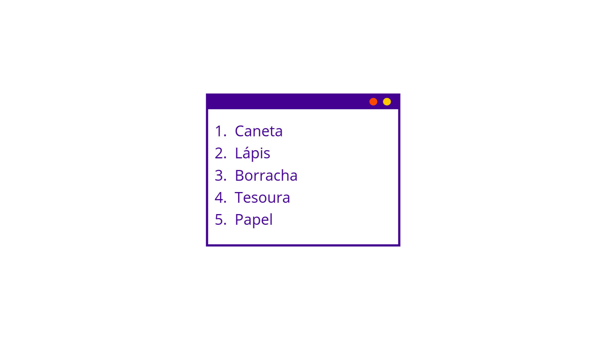

# Estruturando páginas

### Introdução

Agora que já sabemos como criar marcações e entendemos como elas funcionam, vamos aprender novas marcações para criar páginas mais completas.

### Conectando páginas


Sabemos que nossos sites são conjuntos de páginas conectadas, ou lincadas, umas às outras. Agora vamos compreender melhor como isso acontece. A criação do hiperlink foi uma das responsáveis por tornar a web tão maravilhosa como ela é. Foi assim que conseguimos começar a facilmente conectar páginas. 

Qualquer elemento que aparece entre a abertura e o fechamento de tags é a parte que será um link clicável na página. Exemplo:

```markup
<p>Esse é um exemplo de palavra <a href="http://www.vainaweb.com.br"> clicável </a>.</p>
```

Qualquer coisa mesmo, não somente textos. Nós podemos deixar imagens clicáveis também!

```markup
<a href="http://www.vainaweb.com.br">
    
</a>
```

### Listando coisas



Listas ordenadas, assim como o nome parece sugerir, são listas em que a ordem dos itens importa, e eles podem ser enumerados.

```markup
<ol>
    <li>Caneta</li>
    <li>Lápis</li>
    <li>Borracha</li>
    <li>Tesoura</li>
    <li>Papel</li>
</ol>
```

1. Caneta
2. Lápis
3. Borracha
4. Tesoura
5. Papel

Listas não ordenadas não enumeram os itens e podem estar acompanhados apenas de um símbolo.

```markup
<ul>
    <li>Caneta</li>
    <li>Lápis</li>
    <li>Borracha</li>
    <li>Tesoura</li>
    <li>Papel</li>
</ul>
```

* Caneta
* Lápis
* Borracha
* Tesoura
* Papel

### Criando tabelas

Criamos uma tabela com a tag `<table>` uma linha de Table Row, ou `<tr>`. Cada célula de dados será uma Table Data, ou `<td>` podemos, se nececessário, adicionar o atributo rowspan, que vai criar uma expansão de linha nas células. Podemos também usar o atributo colspan e teremos uma expansão de coluna nas células.

```markup
<table>
  <tr>
    <th>Nome</th>
    <th>Sobre</th>
    <th>Cidade</th>
  </tr>
  <tr>
    <td>Maria</td>
    <td>Gosta de cachorros</td>
    <td>Rio de Janeiro</td>
  </tr>
  <tr>
    <td>Rosa</td>
    <td>Solta pipa com os irmãos</td>
    <td>Brasília</td>
  </tr>
  <tr>
    <td>João</td>
    <td>Adora gatos</td>
    <td>Recife</td>
  </tr>
  <tr>
    <td>Ana</td>
    <td>Gosta de árvores</td>
    <td>São Paulo</td>
  </tr>    
</table>
```

| Nome | Sobre | Cidade |
| :--- | :--- | :--- |
| Maria | Gosta de cachorros | Rio de Janeiro |
| Rosa | Solta pipa com os irmãos | Brasília |
| João | Adora gatos | Recife |
| Ana | Gosta de árvores | São Paulo |

